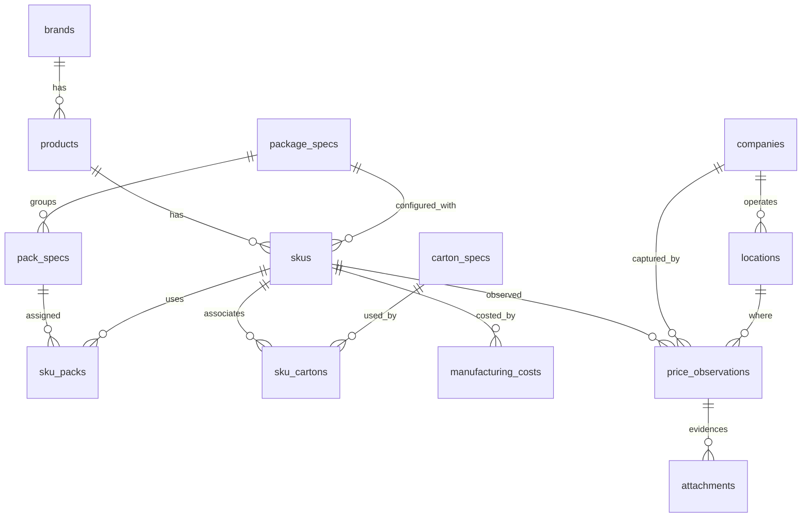

# Competitor Intel

Standalone Dash application for capturing, normalising and visualising competitor pricing for gin bottles and RTD cans. The app is fully isolated under `apps/competitor_intel` with its own database, migrations and UI.

## Features

- Rich schema covering brands, products, SKUs, package specs, **pack specs**, carton specs, manufacturing costs, companies, locations, observations and attachments
- Service layer for GST normalisation, derived metrics (per litre, pure alcohol, standard drinks) plus pack/carton price derivation and gross profit calculations
- CSV importers with downloadable templates, optional entity auto-creation and run summaries surfaced in the UI
- Sample data generator providing ≥10 SKUs and ≥100 observations seeded with pack hierarchies and cost records so analytics and map views have immediate signal
- Dash UI on port 8060 with a single top-level "Competitor Intel" tab and sub-tabs for Overview, SKUs, Observations, Analytics, Map, Data Quality, Import/Export and Settings
- `/health` endpoint for integration checks plus a feature-flagged launch link in the main VNDManuf UI

## Directory Layout

```
apps/competitor_intel/
├── alembic/               # Isolated Alembic env and versions
├── app/
│   ├── config.py          # Environment-driven configuration
│   ├── models/            # SQLAlchemy models and mixins
│   ├── services/          # Normalisation, reports, importers, sample data
│   └── ui/                # Dash app factory, shared components, sub-tabs
├── data_templates/        # CSV templates for SKUs and observations
├── scripts/               # Helper CLIs (imports, sample data seeding)
├── tests/                 # Pytest suite for core calculations
└── README.md              # This guide
```

## Setup & Migrations

```bash
pip install -r apps/competitor_intel/requirements.txt
alembic -c apps/competitor_intel/alembic.ini upgrade head
```

Seed sample data (optional):

```bash
python apps/competitor_intel/scripts/load_sample_data.py
```

## Run the Dash App

```bash
python -m apps.competitor_intel.app.ui.app
```

The app listens on `http://127.0.0.1:8060`. Override host/port/GST/currency/evidence settings via `apps/competitor_intel/.env` (see `.env.example`). The Settings tab also writes updates back to this file.

## CSV Import/Export

- Templates reside in `data_templates/` and are downloadable from the Import/Export tab.
- **SKU CSV** now includes columns for `pack_units`, `pack_gtin`, `carton_units/carton_pack_count`, and manufacturing cost fields (`cost_type`, `cost_per_*`, `cost_effective_date`, `cost_notes`).
- **Observations CSV** supports `is_pack_price` (price basis), optional carton units, and records derived margin columns.
- Command-line importers:
  ```bash
  python apps/competitor_intel/scripts/import_skus.py data_templates/skus.csv --allow-create
  python apps/competitor_intel/scripts/import_observations.py data_templates/observations.csv --allow-create
  ```
- The Dash Import/Export tab accepts drag-and-drop CSV uploads and reports inserted/updated/duplicate/error counts.

## UI Sub-Tabs

| Tab | Highlights |
| --- | --- |
| Overview | KPI cards (now including known/estimated cost coverage), recent observations and quick filters with URL persistence |
| SKUs | Accordion tables for brands/products/packages/**packs**/SKUs/cartons/costs with modal add forms |
| Observations | Filter panel, server-side pagination, CSV export and manual entry modal supporting unit/pack/carton price basis and gross profit visibility |
| Analytics | Time-series comparison and retailer distribution charts |
| Map | Median price per suburb/state on a geo scatter (state fallbacks if no coordinates) |
| Data Quality | Duplicate hash groups, missing GTINs, minimal cost coverage warnings and negative margin detection |
| Import / Export | Template downloads, uploaders and importer status alerts |
| Settings | Host/port/GST/currency/evidence configuration persisted to `.env` |

## Testing & Tooling

```bash
pytest apps/competitor_intel/tests
```

Pre-commit hooks scoped to this namespace live at `apps/competitor_intel/.pre-commit-config.yaml`.

## ERD



## Integration with VNDManuf UI

Set the following in the root `.env` (or via the new entries in `env.example`):

```ini
COMPINTEL_ENABLED=true
COMPINTEL_URL=http://127.0.0.1:8060
```

When enabled, the main VNDManuf header shows an "Open Competitor Intel" button that launches the new Dash app in a fresh tab.

---

For deeper reference consult the service modules in `app/services/` and the batch-safe Alembic revisions under `alembic/versions/`.
