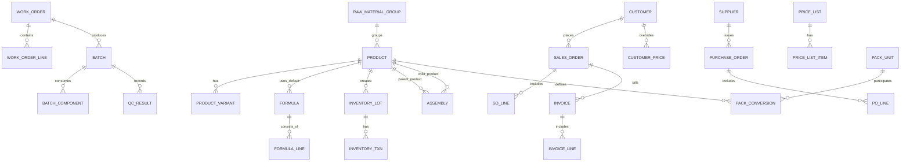

# TPManuf → Modern App (Cursor Build Brief, Consolidated)

This repository contains a **Cursor-ready plan and starter code** to convert the legacy **QuickBASIC TPManuf** system into a modern Python application with API + UI, typed domain, data migration, and golden tests for legacy print artifacts.

> **Units Convention (confirmed):** Use **kg** and **L** for quantities; where ABV appears, treat it as a **% by volume** and convert to mass using product **density (kg/L)** when needed. Canonical storage is **kg** (mass).

---

## 1. Target Stack

- Language: **Python 3.12**
- API: **FastAPI**
- UI: **Dash** (operations/admin), text-first renderers for reports (PDF added later)
- DB: **SQLite (dev)**, **Postgres (prod)** via SQLAlchemy + Alembic
- Tests: **pytest** (+ golden-file tests for print outputs)
- Tooling: **uv/poetry (choose one)**, **ruff/black**, **pre-commit**, **GitHub Actions**
- Docs: **MkDocs (optional)** with Mermaid diagrams (kept under `docs/`)

Everything should be runnable with three commands:

```bash
make setup
make migrate
make run
```

---

## 2. System Overview

TPManuf manages trade-paints manufacturing: formulations (recipes), colour variants, work orders, batch tickets, QC capture, inventory (FIFO), purchasing, despatch, **sales orders & pricing**, **packaging hierarchy (CAN→4PK→CTN)**, **invoicing**, and **assembly operations** (RAW → WIP → FINISHED).

The system uses a **unified product model** that consolidates raw materials, work-in-progress (WIP), and finished goods into a single `products` table with a `product_type` field. This unified structure enables:

- **Seamless assembly operations**: Raw materials can be assembled into WIP, which can be assembled into finished goods
- **Unified inventory tracking**: All product types use the same inventory lot and transaction system
- **Simplified relationships**: All foreign keys reference `products.id` instead of separate tables
- **Consistent API**: Single product endpoint with `product_type` filtering

The goal is feature parity with improved data integrity, traceability, and modern UI.

**Top Day‑1 Tasks**: Products & formulas, create/release WOs, capture batches + QC, inventory receipts/issues, pricing, SOs → shipments → invoices, stock/valuation and usage reports, migration & reconciliation.

---

## 3. Legacy Audit & Behaviour Map

`scripts/legacy_audit.py` will:
- Parse `.BAS/.BI`: entry points, SHARED vars, ON ERROR paths.
- Identify all `OPEN/GET/PUT` usages and record layouts (LEN, FIELD statements).
- Catalogue print/report routines (tickets, invoices). Detect printer control codes.
- Discover pricing structures and any pack conversions in legacy data.
- Emit: `docs/legacy/legacy_mapping.csv` + per-file YAML specs used by migration.

**Preliminary Map**

| Legacy | New Module | Notes |
|---|---|---|
| `MAIN.BAS` | `app/api/main.py` + `app/ui` | API + web UI replace menu loop |
| `FORMULA.BAS` | `app/services/formulas.py` | CRUD + versioning |
| `BATCH.BAS` | `app/services/batching.py` | WO→Batch workflow |
| `INVENT.BAS` | `app/services/inventory.py` | FIFO ledger |
| `PO.BAS` | `app/services/purchasing.py` | Suppliers/POs/receipts |
| `SO.BAS` | `app/services/sales.py` | Sales orders/despatch |
| `PRICE*.BAS` | `app/services/pricing.py` | price resolution (customer → list) |
| `PACK*.BAS` | `app/services/packing.py` | can/4pk/ctn conversions |
| `INV*.BAS` | `app/services/invoicing.py` | invoice + print |
| `REPORTS.BAS` | `app/reports/*.py` | Jinja2/text renderers |

---

## 4. Domain Model & Schema (Authoritative)

### ERD (Mermaid)


### Unified Product Model
The product model has been unified to support **RAW**, **WIP**, and **FINISHED** product types in a single table:

- **Product.product_type**: String field (`RAW`, `WIP`, `FINISHED`) classifying the product (indexed, default: `RAW`)
- **RAW products**: Include raw material specific fields:
  - `raw_material_code`: Legacy QB material code (Integer, indexed)
  - `specific_gravity`, `vol_solid`, `solid_sg`, `wt_solid`: Physical properties
  - `usage_cost`, `usage_unit`: Usage pricing
  - `restock_level`, `used_ytd`: Stock management
  - `hazard`, `condition`, `msds_flag`: Safety flags
  - `raw_material_group_id`: FK to raw_material_groups
  - All other raw material specific fields from legacy structure
- **WIP products**: Work-in-progress items created during batch production:
  - Created automatically when finishing batches with `create_wip=True`
  - Can be used in assemblies (RAW → WIP → FINISHED)
  - Tracked in same inventory system as RAW and FINISHED
- **FINISHED products**: Sellable finished goods:
  - `formula_id`, `formula_revision`: Link to default formula
  - All standard product fields for pricing, packaging, etc.

**Key Benefits:**
- Single inventory tracking system for all product types via `InventoryLot` and `InventoryTxn`
- Unified assembly operations supporting multi-stage workflows:
  - RAW → WIP (via batch completion or assembly)
  - WIP → FINISHED (via assembly or batch completion)
  - RAW → FINISHED (direct assembly)
- Simplified foreign key relationships:
  - `formula_lines.product_id` references `products.id` (was `raw_materials.id`)
  - `inventory_movements.product_id` references `products.id` (was `item_type/item_id`)
  - `work_order_lines.ingredient_product_id` references `products.id`
  - `batch_components.ingredient_product_id` references `products.id`
- Consistent API and service layer: single product endpoint with `product_type` filtering
- Backward compatibility: `FormulaLine.raw_material` property for legacy code

**Migration Notes:**
- Legacy `raw_materials` and `finished_goods` tables migrated to `products` table
- Migration script (`9472b39d71be_unified_products_migration.py`) handles:
  - Data migration from legacy tables
  - Foreign key updates
  - Inventory lot creation from legacy SOH
  - Migration mapping table (`product_migration_map`) for tracking
- `formula_lines.product_id` replaces `formula_lines.raw_material_id` (with backward compat property)
- `inventory_movements.product_id` replaces `inventory_movements.item_type/item_id`
- Legacy tables (`raw_materials`, `finished_goods`) kept as read-only references

### DDL
> See `db/alembic/` migrations driven from SQLAlchemy models. The schema includes: **unified products** (with product_type: RAW/WIP/FINISHED), variants, formulas/lines (using unified product_id), inventory lots/txns (FIFO), assemblies, WOs, batches, QC, suppliers/POs, customers/SOs, **invoices**, **pricing** (lists + overrides), **pack units** & **conversions**.

---

## 5. Units, Conversions, and ABV (Confirmed)

- **Canonical storage**: mass in **kg**.
- **Liquids**: if ingested in **L**, convert to **kg** using `kg = L * density(kg/L)`.
- **ABV %**: volume fraction; when mass is required, convert via density of the liquid (e.g., ethanol/water mixture or product density); store ABV as `%` field alongside mass.
- **Rounding**: quantities to **3 dp**, money to **2 dp**; bankers’ rounding at commit.

---

## 6. Data Migration Plan

- Per-file spec YAMLs from audit: field name, offset/length, type, scale.
- Migration order: products → formulas/lines → suppliers/customers → pricing → pack units/conversions → inventory lots → inventory txns → WOs/batches/QC → SOs → invoices.
- Idempotent upserts using natural keys (SKU, codes). Emit `out/audit.csv` + `out/anomalies/*.csv`.
- Reconcile counts and numeric totals within **±0.1%**; fail CI if exceeded.

**Fixed-width parser example** in `app/adapters/legacy_io.py`.

---

## 7. API & UI Spec (Highlights)

**Products API** (`/api/v1/products`):
- `GET /products?product_type=RAW|WIP|FINISHED`: List products with optional type filtering
- `GET /products/{id}`: Get product by ID
- `GET /products/sku/{sku}`: Get product by SKU
- `POST /products`: Create product (with product_type and type-specific fields)
- `PUT /products/{id}`: Update product
- `DELETE /products/{id}`: Soft delete (sets is_active=False)

**Assembly API** (`/api/v1/assemblies`):
- `POST /assemblies/assemble`: Assemble parent from children (supports RAW→WIP→FINISHED)
- `POST /assemblies/disassemble`: Disassemble parent into children

**Other APIs**: Formulas, Inventory (FIFO), Work Orders, Batches (+QC), Purchasing, Sales Orders, **Pricing** (`/pricing/resolve`), **Packing** (`/pack/convert`), **Invoices** (`/invoices`, `/invoices/{id}/print?format=text|pdf`).

UI pages: Dash tables/forms for all above, plus print preview. Product listing includes product_type filter dropdown.

---

## 8. Reports & Golden Tests

**Fixtures** (already included):
- `fixtures/print/B060149.PRN` (batch ticket sample)
- `fixtures/print/00086633.INS` (invoice sample)

**Normalizer** strips legacy printer control codes and normalizes whitespace.
Golden tests compare **normalized text** from new renderers to legacy fixtures.

---

## 9. Security, Logging, and CI

- Local JWT roles: Operator, Planner, Admin.
- JSON logging with request IDs.
- GitHub Actions CI: lint, test, build.

---

## 10. Roadmap

- M0 Repo+CI → M1 Schema+Audit → M2 Migration MVP → **M2.5 Pricing+Pack** → M3 Core Services → M4 UI+Reports (goldens) → M5 UAT+Cutover.

---

## 11. Acceptance Checklist

- [ ] Schema + migrations apply; migration script idempotent.
- [ ] All legacy files mapped (or deprecated) in `docs/legacy/legacy_mapping.csv`.
- [ ] Pricing, Packaging, Invoicing operational.
- [ ] Golden tests pass for batch ticket and invoice (text mode).
- [ ] Stock balances & valuation reconcile within ±0.1%.
