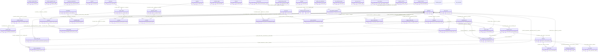

# Database Entity Relationship Diagram

This diagram shows all tables and their relationships in the database.

```mermaid
erDiagram

    %% Entity Definitions
    %% Product Hierarchy Domain
    product_channel_links {
        string id "id channel"
    }
    product_migration_map {
        string id "id legacy_table"
    }
    product_variants {
        string id "id variant_code variant_name"
    }
    products {
        string id "id sku"
    }
    %% Manufacturing Domain
    batch_components {
        string id "id quantity_kg unit_cost"
    }
    batch_lines {
        string id "id role qty_theoretical"
    }
    batches {
        string id "id batch_code quantity_kg"
    }
    formula_lines {
        string id "id quantity_kg sequence"
    }
    formulas {
        string id "id formula_code formula_name"
    }
    qc_results {
        string id "id test_name test_value"
    }
    work_order_lines {
        string id "id required_quantity_kg allocated_quantity_kg"
    }
    work_orders {
        string id "id code quantity_kg"
    }
    %% Inventory Domain
    inventory_lots {
        string id "id lot_code quantity_kg"
    }
    inventory_movements {
        string id "id ts date"
    }
    inventory_reservations {
        string id "id qty_canonical source"
    }
    inventory_txns {
        string id "id transaction_type quantity_kg"
    }
    %% Assembly Domain
    assemblies {
        string id "id effective_from effective_to"
    }
    assembly_cost_dependencies {
        string id "id dependency_ts"
    }
    assembly_lines {
        string id "id quantity sequence"
    }
    %% Sales Domain
    contacts {
        string id "id code name"
    }
    customers {
        string id "id code name"
    }
    invoice_lines {
        string id "id quantity_kg unit_price_ex_tax"
    }
    invoices {
        string id "id invoice_number invoice_date"
    }
    sales_orders {
        string id "id so_number status"
    }
    so_lines {
        string id "id quantity_kg unit_price_ex_tax"
    }
    %% Purchasing Domain
    po_lines {
        string id "id quantity_kg unit_price"
    }
    purchase_orders {
        string id "id po_number status"
    }
    suppliers {
        string id "id code name"
    }
    %% Pricing Domain
    customer_prices {
        string id "id unit_price_ex_tax effective_date"
    }
    price_list_items {
        string id "id unit_price_ex_tax effective_date"
    }
    price_lists {
        string id "id code name"
    }
    %% Packaging Domain
    pack_conversions {
        string id "id conversion_factor is_active"
    }
    pack_units {
        string id "id code name"
    }
    %% Reference Domain
    condition_types {
        string id "id code description"
    }
    datasets {
        string id "id code name"
    }
    excise_rates {
        string id "id date_active_from rate_per_l_abv"
    }
    manufacturing_config {
        string id "id qtyf bchno_width"
    }
    markups {
        string id "id code name"
    }
    quality_test_definitions {
        string id "id code name"
    }
    raw_material_groups {
        string id "id code name"
    }
    %% Legacy Domain
    finished_goods_inventory {
        string id "fg_id soh"
    }
    legacy_acstk_data {
        string id "id legacy_no legacy_search"
    }
    %% Integration Domain
    xero_sync_log {
        string id "id ts object_type"
    }
    xero_tokens {
        string id "id access_token refresh_token"
    }
    %% Other Domain
    alembic_version {
        string id "version_num"
    }
    formula_classes {
        string id "id name description"
    }
    raw_material_suppliers {
        string id "id is_primary min_qty"
    }
    revaluations {
        string id "id old_unit_cost new_unit_cost"
    }

    %% Relationships
    assemblies ||--o{ assembly_lines : "fk_assembly_lines__assembly_id__assemblies"
    batches ||--o{ batch_components : "fk_batch_components__batch_id__batches"
    batches ||--o{ batch_lines : "fk_batch_lines__batch_id__batches"
    batches ||--o{ inventory_movements : "fk_inventory_movements__source_batch_id__batches"
    batches ||--o{ qc_results : "fk_qc_results__batch_id__batches"
    customers ||--o{ customer_prices : "fk_customer_prices__customer_id__customers"
    customers ||--o{ invoices : "fk_invoices__customer_id__customers"
    customers ||--o{ sales_orders : "fk_sales_orders__customer_id__customers"
    finished_goods ||--o{ finished_goods_inventory : "fk_finished_goods_inventory__fg_id__finished_goods"
    formulas ||--o{ formula_lines : "fk_formula_lines__formula_id__formulas"
    formulas ||--o{ work_orders : "fk_work_orders__formula_id__formulas"
    inventory_lots ||--o{ assembly_cost_dependencies : "fk_dep_consumed_lot"
    inventory_lots ||--o{ assembly_cost_dependencies : "fk_dep_produced_lot"
    inventory_lots ||--o{ batch_components : "fk_batch_components__lot_id__inventory_lots"
    inventory_lots ||--o{ inventory_txns : "fk_inventory_txns__lot_id__inventory_lots"
    inventory_lots ||--o{ revaluations : "fk_reval_lot"
    inventory_txns ||--o{ assembly_cost_dependencies : "fk_dep_consumed_txn"
    inventory_txns ||--o{ assembly_cost_dependencies : "fk_dep_produced_txn"
    invoices ||--o{ invoice_lines : "fk_invoice_lines__invoice_id__invoices"
    pack_units ||--o{ pack_conversions : "fk_pack_conversions__from_unit_id__pack_units"
    pack_units ||--o{ pack_conversions : "fk_pack_conversions__to_unit_id__pack_units"
    price_lists ||--o{ price_list_items : "fk_price_list_items__price_list_id__price_lists"
    products ||--o{ assembly_lines : "fk_assembly_lines__component_product_id__products"
    products ||--o{ batch_components : "fk_batch_components__ingredient_product_id__products"
    products ||--o{ batch_lines : "fk_batch_lines__material_id__products"
    products ||--o{ customer_prices : "fk_customer_prices__product_id__products"
    products ||--o{ formulas : "fk_formulas__product_id__products"
    products ||--o{ inventory_lots : "fk_inventory_lots__product_id__products"
    products ||--o{ invoice_lines : "fk_invoice_lines__product_id__products"
    products ||--o{ legacy_acstk_data : "fk_legacy_acstk_data__product_id__products"
    products ||--o{ pack_conversions : "fk_pack_conversions__product_id__products"
    products ||--o{ po_lines : "fk_po_lines__product_id__products"
    products ||--o{ price_list_items : "fk_price_list_items__product_id__products"
    products ||--o{ product_variants : "fk_product_variants__product_id__products"
    products ||--o{ revaluations : "fk_reval_item"
    products ||--o{ so_lines : "fk_so_lines__product_id__products"
    products ||--o{ work_order_lines : "fk_work_order_lines__ingredient_product_id__products"
    products ||--o{ work_orders : "fk_work_orders__product_id__products"
    purchase_orders ||--o{ po_lines : "fk_po_lines__purchase_order_id__purchase_orders"
    raw_materials ||--o{ raw_material_suppliers : "fk_raw_material_suppliers__raw_material_id__raw_materials"
    sales_orders ||--o{ invoices : "fk_invoices__sales_order_id__sales_orders"
    sales_orders ||--o{ so_lines : "fk_so_lines__sales_order_id__sales_orders"
    suppliers ||--o{ purchase_orders : "fk_purchase_orders__supplier_id__suppliers"
    suppliers ||--o{ raw_material_suppliers : "fk_raw_material_suppliers__supplier_id__suppliers"
    work_orders ||--o{ batches : "fk_batches__work_order_id__work_orders"
    work_orders ||--o{ work_order_lines : "fk_work_order_lines__work_order_id__work_orders"
```
